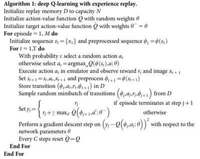

# Algorithm description

The algorithm used to solve the environment is **deep Q learning**, which is basically an extension of the Q Learning approach to support continuos environment states, by means approximate Q value functions. 

## Q Learning

Q Learning is part of the bigger family of **Temporal Difference algorithms**. Differently to Montecarlo methods, Temporal Difference methods do not need to wait the end of an episode to update the Q Value function. TD Algorithms use the difference between a target next-step(s) return estimate and the current return estimate to update the Q function. Specifically for Q Learning (also Sarsamax) algorithm, the target estimate is $R_{t+1} + \gamma max_a Q(S_{t+1}, a)$ , i.e. it uses a greedy policy to pick the next-step action for the estimate. 

## Deep Q Learning

Deep Q Learning extends the Q Learning algorithm to overcome the limitation of finite state spaces. The Q values are not contained in a table anymore, but they are approximated by a neural network - the **Q network** - which takes the state as input and returns action values for each action as output.

Two additions to the original idea that are crucial for the success of Deep-Q-Networks are: **experience replay** and **fixed Q-targets**. 

#### Experience replay

When the agent interacts with the environment, the sequence of experience tuples can be highly correlated. The naive Q-learning algorithm that learns from each of these experience tuples in sequential order runs the risk of getting swayed by the effects of this correlation. By instead keeping track of a **replay buffer** and using it to sample from the buffer at random, we can prevent action values from oscillating or diverging catastrophically.

The **replay buffer** contains a collection of experience tuples $(S, A, R, S')$. The tuples are gradually added to the buffer as we are interacting with the environment.

The act of sampling a small batch of tuples from the replay buffer in order to learn is known as **experience replay**. In addition to breaking harmful correlations, experience replay allows us to learn more from individual tuples multiple times, recall rare occurrences, and in general make better use of our experience.

#### Fixed-Q-Networks

The second modification to online Q-learning aimed at further improving the stability of our method with neural networks. In Q-Learning, we **update a guess with a guess**, and this can potentially lead to harmful correlations. To avoid this, the idea is to use a separate network for generating the targets $y_j$ in the Q-learning update (see pseudo code from the original paper below). This modification makes the algorithm more stable compared to standard online Q-learning, where an update that increases $Q(s_t,a_t)$ often also increases $Q(s_{t+1},a)$ for all $a$ and hence also increases the target $y_j$, possibly leading to oscillations or divergence of the policy. 

Generating the targets using an older set of parameters adds a delay between the time an update to Q is made and the time the update affects the targets $y_j$, making divergence or oscillations much more unlikely.




## Hyperparameters

The environment is solved with the following hyperparameters:
```python
buffer_size=int(1e5) # buffer size for experience replay
batch_size=64 # minibatch size 
gamma=0.99 # discount factor
tau=1e-3 # for soft update of target Q and current Q (not present in original algorithm)
lr=5e-4 # learning rate
update_every=4 # how often to update the Q, according to the fixed-Q-targets logic
```

## Model architecture

The model architecture for both Q target and Q current is a neural network with 2 hidden layers and 64 nodes each.

## Results

It took the algorithm 488 episodes to solve the environment. The plot of rewards, without any averaging, is the following:


# Future ideas

The first natural improvement to this solution is to run extensive hyperparameter search to find the best combination among all possible settings. This can be done by simple but expensive grid search, by random search, or by some more advanced Bayesian approach that iteratively updates its belief about the best region of the search space based on previous results.

Another natural improvement to this solution is using one of the more advanced algorithms that builds on this DQN idea and add further improvements (e.g., DoubleDQN, Prioritized Experience Replay, Dueling Networks...)

